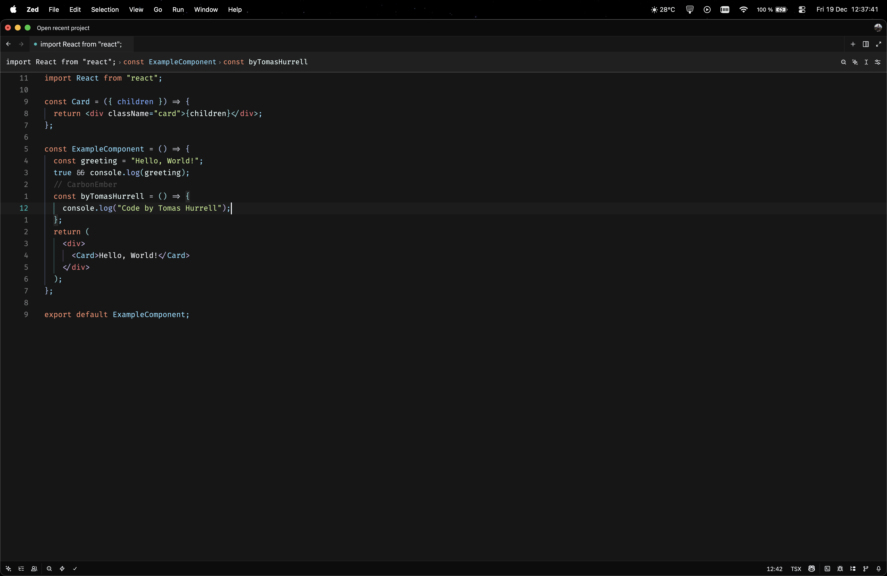
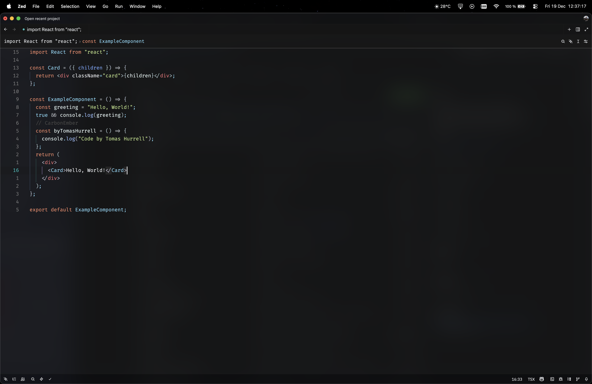

A dark theme for [Zed](https://zed.dev) inspired by [EdenEasts Nightfox](https://github.com/EdenEast/nightfox.nvim), Carbonfox variant, nvim theme
and [Material Theme](https://github.com/t3dotgg/vsc-material-but-i-wont-sue-you) for syntax inspired colors.

## License
This project is licensed under the MIT License - see the [LICENSE](LICENSE) file for details.
This project also includes third-party components under the Apache License 2.0. See the [NOTICE](NOTICE) file for full attributions.
